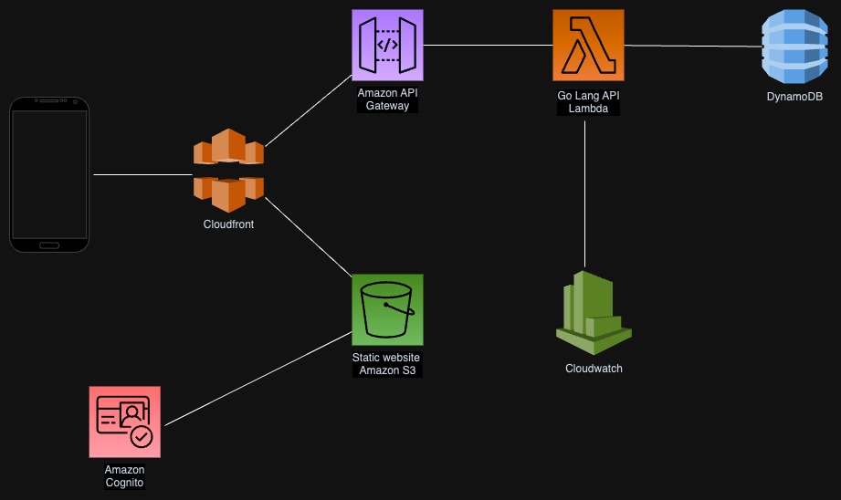

# rolodex-utilitor

Inside this project you will find two folders at root, client and server.

- The client houses a next js app which deploys as a static website.
- The server is a Go api which is deployed as a lambda.

## Architecture

## Infrastructure

All infra for client and server is located at root in the platform_config folder.

s3 bucket name for infrastructure `rolodex-utilitor-terraform-state`.

michael_caley@**\*\***.com

S3: http://rolodex-utilitor-website.s3-website.eu-west-2.amazonaws.com/
API gateway: https://nh0hmn0bzk.execute-api.eu-west-2.amazonaws.com/deployed
cloudfront: https://d12si818kne643.cloudfront.net/

## Secrets
* CLIENT_ID is the cognito client id.
* CLIENT_SECRET is the cognito client secret.

## Todo

- src\components\Add-Contact\Add-Contact.tsx
- ui add contact
- update a contact
- delete a contact

https://rolodex-utilitor.auth.eu-west-2.amazoncognito.com/login?client_id=65u34livlolumvk8adv9bjs2fl&response_type=code&scope=email+openid&redirect_uri=http%3A%2F%2Flocalhost%3A3000%2Flogin

https://docs.aws.amazon.com/cognito/latest/developerguide/userinfo-endpoint.html

## Design

- https://v0.dev/
